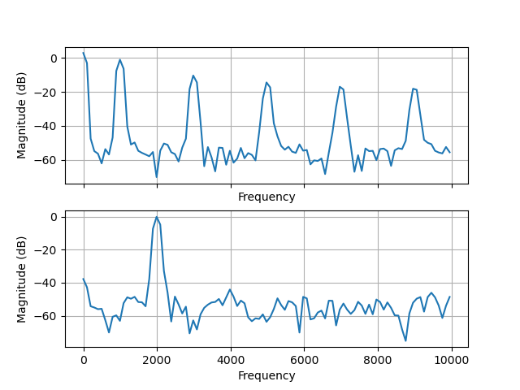
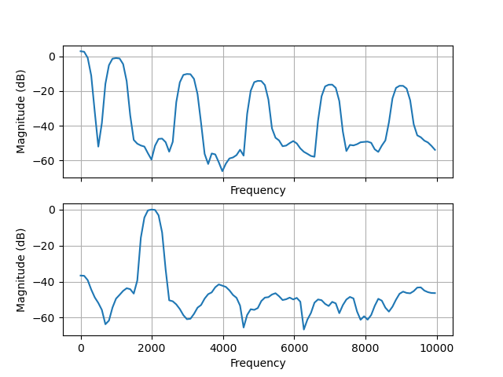
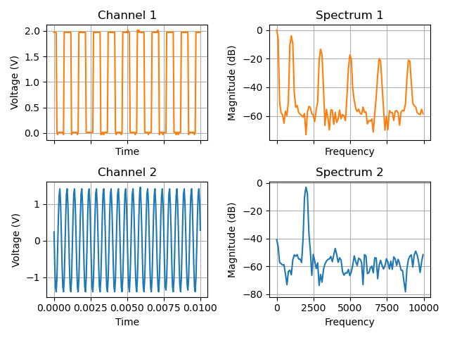

# List of examples programs

`calibrate_6022.py`, `capture_6022.py`, `frequency.py`, `get_serial_number.py`,
`set_cal_out_freq_6022.py` and `upload_firmware_6022.py` are thin wrappers, their
implementation lives in the `PyHT6022` package. The same code is installed as the
commands `calibrate_6022`, `capture_6022`, `frequency_6022`,
`get_serial_number_6022` and `upload_firmware_6022`
(see the corresponding man pages), the wrappers behave identically and can be
run directly from this directory - the `PyHT6022` symlink here makes the package
importable. All other programs in this directory are standalone.

## Device information

### `get_serial_number.py`
```
Usage: get_serial_number_6022 - get serial number from Hantek 6022BE/BL oscilloscope
```
Prints the serial number to stdout, product name and firmware version to stderr.

## Calibration

### `calibrate_6022.py`
```
usage: calibrate_6022.py [-h] [-c] [-e] [-g]

Measure offset and gain calibration values

options:
  -h, --help           show this help message and exit
  -c, --create_config  create a config file
  -e, --eeprom         store calibration values in eeprom
  -g, --measure_gain   interactively measure gain (as well as offset)
```
## Measure

### `frequency.py` (legacy name: `set_cal_out_freq_6022.py`)
```
usage: frequency.py [-h] [-e] [--min | --max] [-t TIME] FREQ

Set the calibration output frequency of Hantek6022

positional arguments:
  FREQ             calibration frequency in Hz (32 ... 100000)

options:
  -h, --help       show this help message and exit
  -e, --exact      fail if FREQ is not representable instead of rounding it
  --min            set the smallest representable frequency >= FREQ (433 -> 440 Hz)
  --max            set the largest representable frequency <= FREQ (433 -> 430 Hz)
  -t, --time TIME  hold the USB connection open for TIME seconds so the calibration output keeps
                   running (default: until interrupted)
```
Sets the calibration output between 32 Hz and 100 kHz. The firmware accepts only
32 Hz, 40...990 Hz in 10 Hz steps, 100...5500 Hz in 100 Hz steps and
1...100 kHz in 1 kHz steps. A value in between is rounded to the nearest one
(a warning is printed to stderr); `--min` instead sets the smallest
representable frequency >= FREQ, `--max` the largest one <= FREQ.
With `--exact` such a value is rejected and the nearest supported frequencies
are listed instead.

After setting the frequency the program keeps its USB connection to the scope
open (`-t TIME` seconds, or until `^C`) so the port stays active: an idle port
would be autosuspended by the kernel after a few seconds, which parks the FX2
CPU and freezes the software generated output.

### `capture_6022.py`
```
usage: capture_6022.py [-h] [-d [DOWNSAMPLE]] [-g] [-o OUTFILE] [-r RATE]
                       [-t TIME] [-x CH1] [-y CH2]

Capture data from both channels of Hantek6022

options:
  -h, --help            show this help message and exit
  -d, --downsample [DOWNSAMPLE]
                        downsample 256 x DOWNSAMPLE
  -g, --german          use comma as decimal separator
  -o, --outfile OUTFILE
                        write the data into OUTFILE (default: stdout)
  -r, --rate RATE       sample rate in kS/s (20, 32, 50, 64, 100, 128, 200,
                        default: 20)
  -t, --time TIME       capture time in seconds (default: 1.0)
  -x, --ch1 CH1         gain of channel 1 (1, 2, 5, 10, default: 1)
  -y, --ch2 CH2         gain of channel 2 (1, 2, 5, 10, default: 1)
```

## Visualise captured values

### `fft_from_capture_6022.py`
```
usage: fft_from_capture_6022.py [-h] [-i INFILE] [-f | -n] [-x]

Plot FFT of output from capture_6022.py, use hann windowing as default

options:
  -h, --help            show this help message and exit
  -i INFILE, --infile INFILE
                        read the data from INFILE, (default: stdin)
  -f, --flat_top        use flat top window
  -n, --no_window       use no window
  -x, --xkcd            plot in XKCD style :)
```
#### Hann window

#### Flat top window


### `plot_from_capture_6022.py`
```
usage: plot_from_capture_6022.py [-h] [-i INFILE] [-c CHANNEL] [-s [MAX_FREQ]] [-x]

Plot output of capture_6022.py over time

options:
  -h, --help            show this help message and exit
  -i INFILE, --infile INFILE
                        read the data from INFILE (default: stdin)
  -c CHANNEL, --channel CHANNEL
                        show only CH1 or CH2, default: show both)
  -s [MAX_FREQ], --spectrum [MAX_FREQ]
                        display the spectrum of the samples, optional up to MAX_FREQ
  -x, --xkcd            plot in XKCD style :)
```



## Test and development support

### `upload_6022_firmware_from_hex.py`
```
usage: upload_6022_firmware_from_hex.py HEXFILE
```
Uploads firmware from intel hex file to device

### `upload_6022_firmware.py`
Uploads standard firmware to device - deprecated, will be replaced by `upload_firmware_6022.py`

### `upload_firmware_6022.py`
```
usage: upload_firmware_6022.py [-h] [-V VID] [-P PID] [--be | --bl]

Upload firmware to Hantek6022 devices with different VID:PID

options:
  -h, --help      show this help message and exit
  -V, --VID VID   set vendor id (hex)
  -P, --PID PID   set product id (hex)
  --be, --6022be  use DSO-6022BE firmware
  --bl, --6022bl  use DSO-6022BL firmware
```

This tool can be used to upload the firmware to devices with
[damaged EEPROM content](https://github.com/Ho-Ro/Hantek6022API/discussions/28).
These devices enumerate as Cypress development kit with VID:PID 04b4:8613.

```
$ lsusb | grep Cypress
Bus 002 Device 021: ID 04b4:8613 Cypress Semiconductor Corp. CY7C68013 EZ-USB FX2 USB 2.0 Development Kit

$ ./upload_firmware_6022.py --VID 04b4 --PID 8613 --6022be
upload DSO-6022BE firmware
FW version 0x210
Serial number CF81BA1F3532

$ lsusb | grep Hantek
Bus 002 Device 022: ID 04b5:6022 ROHM LSI Systems USA, LLC Hantek DSO-6022BE
```

### `reset_eeprom_6022.py`
**Warning:** this program will delete all calibration values from EEPROM - use with care!
